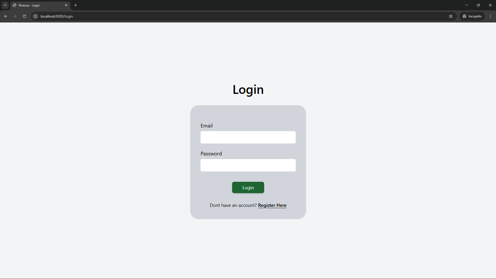
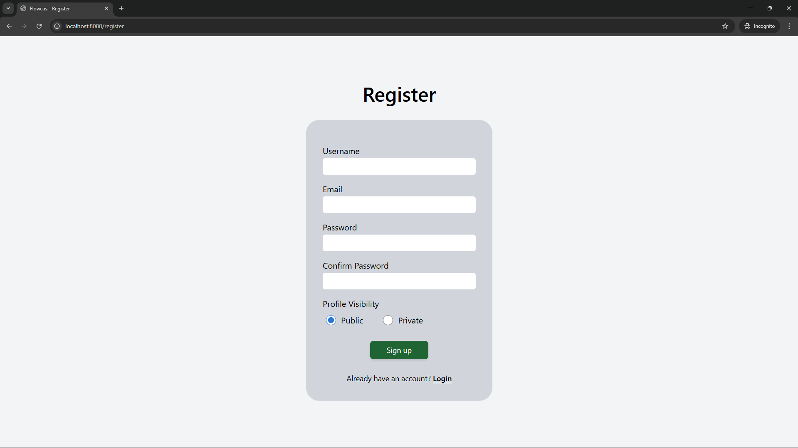
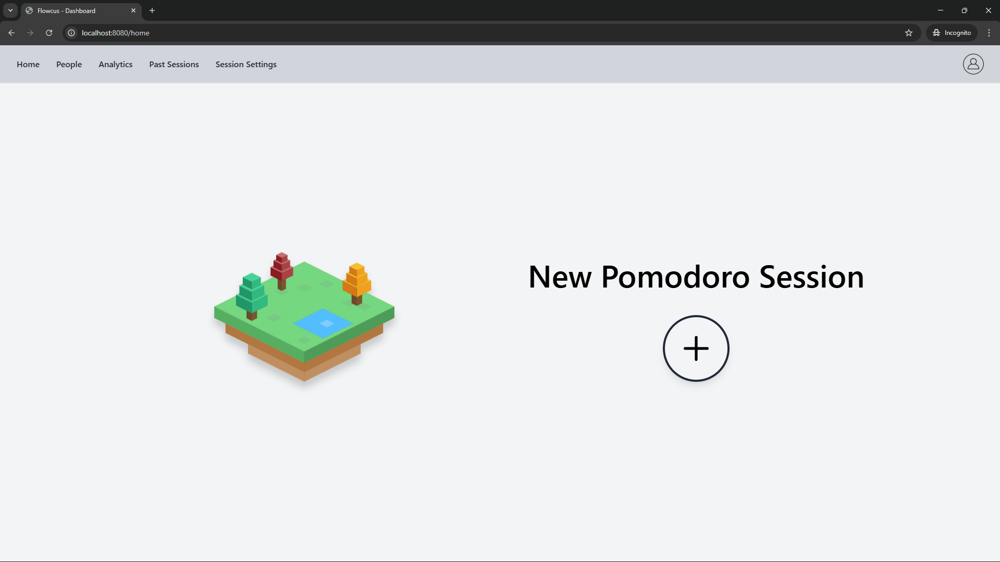
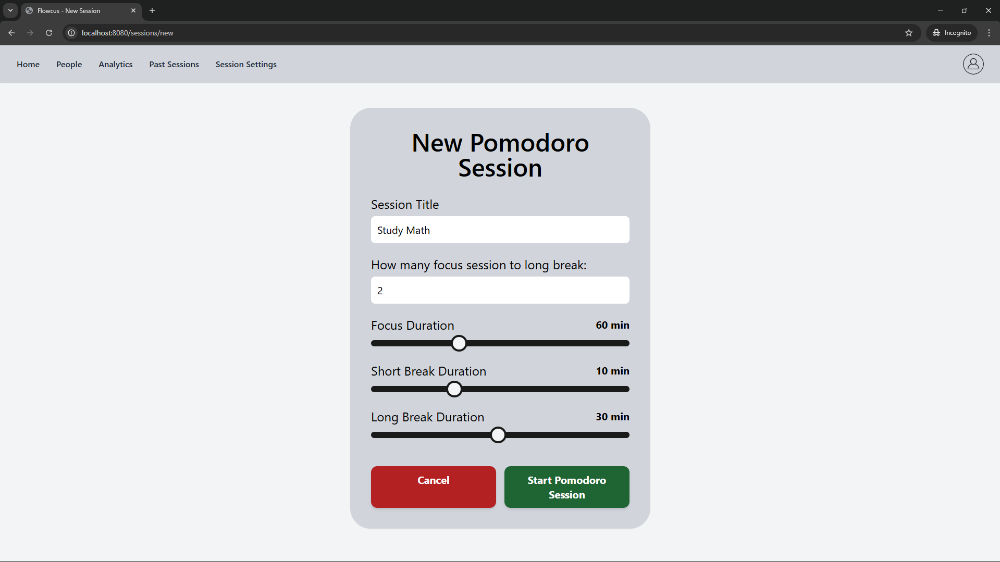
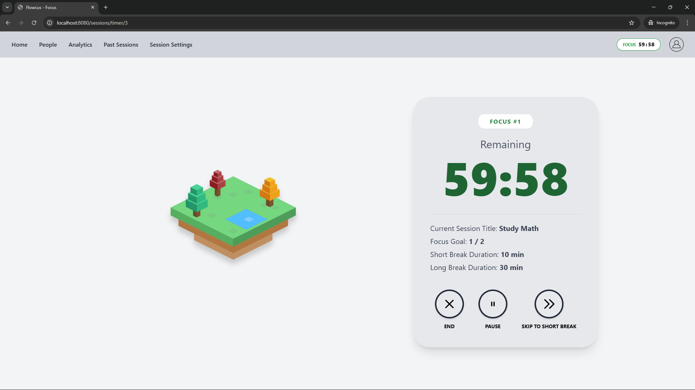
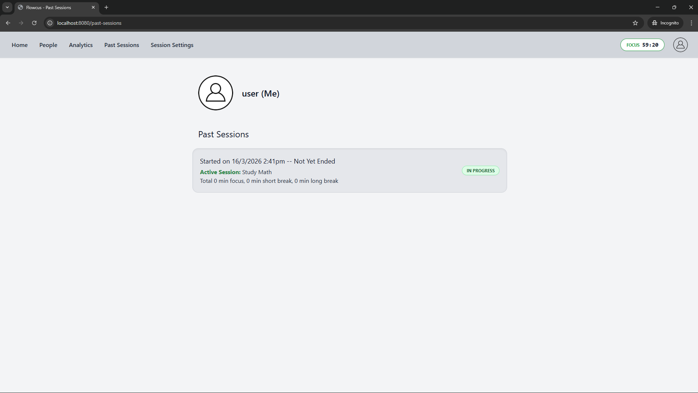
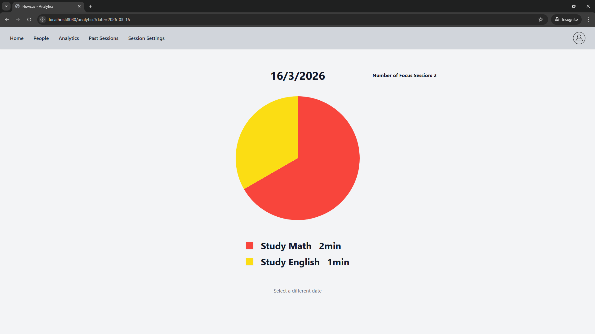
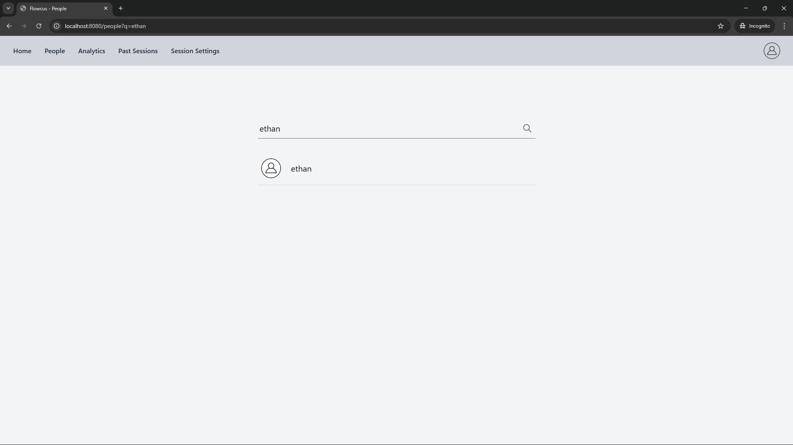
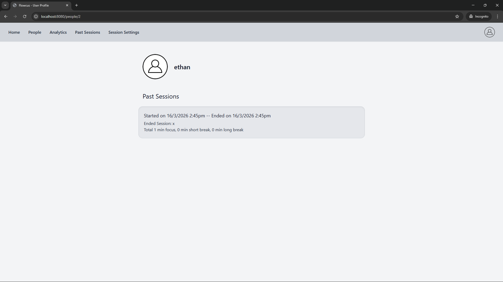

# Flowcus v1.0 - Pomodoro & Productivity Platform

Flowcus is a web application designed to help users maximize productivity using customizable Pomodoro intervals. It is built with Java, Spring Boot, Thymeleaf, Tailwind CSS.

---

## Key Features

* **Customizable Pomodoro Sessions:** Users can define specific durations for focus blocks, short breaks, and long breaks.
* **Global Timer Synchronization:** A real-time navigation widget tracks active sessions across the entire application.
* **Comprehensive Analytics:** Visualize historical focus data in a chart & listing the user's past Pomodoro sessions.
* **User Discovery & Accountability:** Integrated a robust search functionality enabling users to find peers and view their public session history, fostering a community of shared productivity.
---

## Project Showcase
**Login:**


**Register:**


**Home:**


**New Session:**


**Focus Session:**


**Past Sessions:**


**Analytics:**


**Searching other user profile:**


**Viewing other user profile:**



---

## Technical Architecture

* **Architecture:** Complete separation of concerns between Controllers (HTTP traffic), Services (Business Logic), Repositories (Data Access), and Entities (Data Modeling).
* **Secure Data Transfer (DTOs):** Absolute prevention of Entity Leakage. Raw database models are never exposed to the web layer. Strict DTO mappings ensure passwords remain secure.
* **Defensive Programming & Validation:**
    * Implemented strict server-side validation (`@Valid`, `@NotBlank`, `@Email`).
    * Secured against Parameter Tampering using `@Pattern` Regex enforcement for UI-driven enums.
* **Security & Authentication:** Managed via Spring Security. Utilizes Dependency Injection for centralized `BCryptPasswordEncoder` hashing.

---

## Tech Stack I Used In This Project

* **Backend:** Java 17, Spring Boot, Spring Security, Spring Data JPA, Hibernate.
* **Database:** MySQL.
* **Frontend:** Thymeleaf, Tailwind CSS, JavaScript.
---

## How to Run Locally

### Prerequisites
* Java Development Kit (JDK) 17 or higher
* Maven
* MySQL Server (running on default port 3306)

### Installation

1. **Clone the repository**

2. **Configure the database in src/main/resources/application.properties:**
   ```bash
   spring.datasource.url=jdbc:mysql://localhost:3306/flowcus_db
   spring.datasource.username=your_username
   spring.datasource.password=your_password 
   ```

3. **Build and run the application:**
   ```bash
   mvn clean install
   mvn spring-boot:run
   ```
4. **Open your browser and navigate to http://localhost:8080**